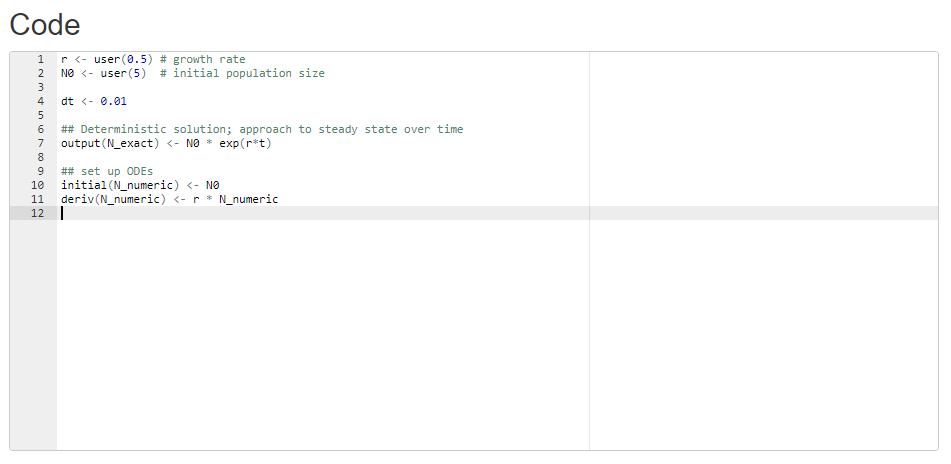
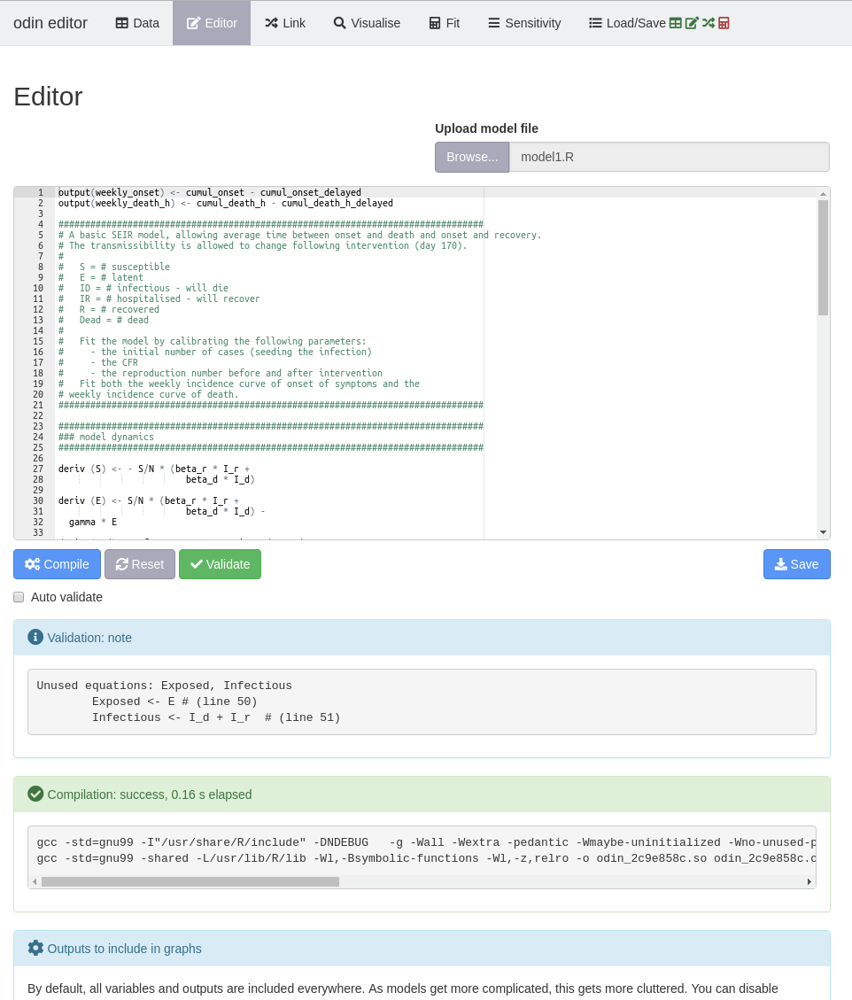
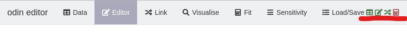
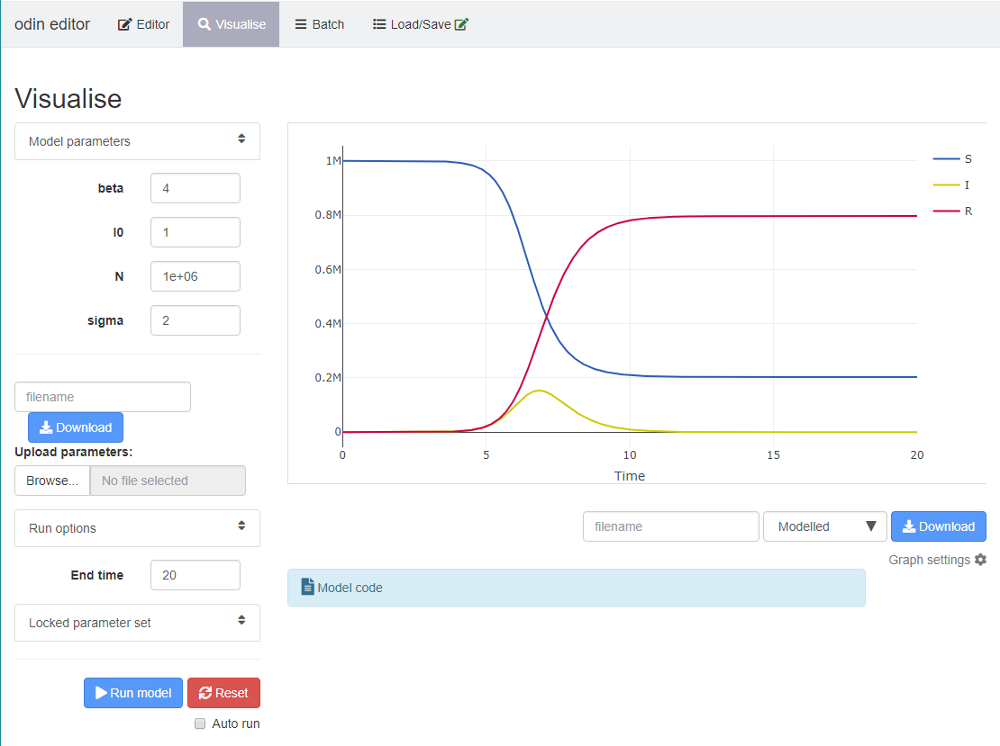
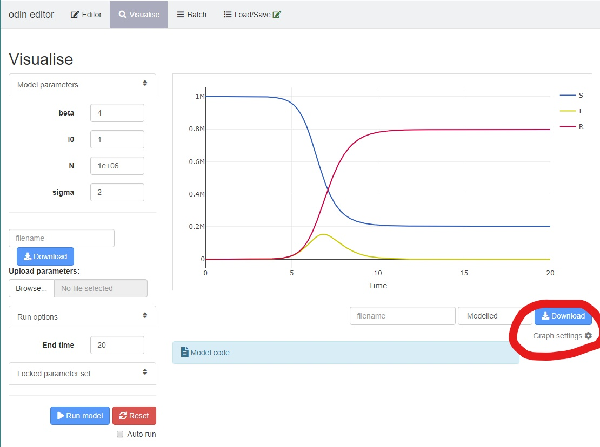

## Introduction

This interface is built using an R package called `shiny` using the R programming language.
Over the 2-week short course you will be using this interface to explore and understand the basics of infectious disease modelling.

Built into the interface is an R package called [`odin`](https://mrc-ide.github.io/odin/) which implements a high-level language for describing and implementing ordinary differential equations in R. The actual solution of the differential equations is done with the `deSolve` package.


## Writing your own models in the interface

### The code editor

You can type your model (equations, parameters, intitial values) directly into the code editor which looks something like this: 

To specify an object use `<-` or `=`. You can also add comments and notes to your code by using the `#` symbol.
Standard mathematical operators e.g. `*`, `/`, `+`, `-` etc are all supported.
For example:

```
x <- 3 * 5 # this is a comment after the "#"
```

### Differential equations
Remember from day 1 where you wrote out your own differential equations from the flowcharts?
They looked something like this for a basic SIR model:

$$ \frac{dS}{dt} = -\frac{\beta\ SI}{N} $$
$$ \frac{dI}{dt} = \frac{\beta\ SI}{N} -\sigma I $$
$$ \frac{dR}{dt} = \sigma I $$

These differential equations in the odin language are then specified as follows:

```
  deriv(S) <-  - beta * S * I / N
  deriv(I) <- beta * S * I / N - sigma * I
  deriv(R) <- sigma * I

```

So each variable is specified by `deriv(variable)`.
This specifies that `variable` is a variable that will change over time.

### Intital conditions
Every variable (`deriv(variable)`) then needs an initial condition. These are specified using `initial(variable)`.

So for the example equations above, you might specify intital values as:

```
  initial(S) <- N - I0
  initial(I) <- I0
  initial(R) <- 0
```

### Parameter values
Each parameter then also needs a value. These are specified using `parameter_name <- user(parameter_value)`

```
  N <- user(1e6)
  I0 <- user(1)
  beta <- user(4)
  sigma <- user(2)
```

Note here that `odin` does not allow functions within user defined variables. For example:

```
  sigma <- user(10)   # this is fine
  sigma <- user(20/2) # it does not like this
```

### Compiling and running your model

Once you are happy with your model coded in the editor, you can "run"/"compile" the model (depending on your practical session). Any errors in your odin code should throw a relevant error message just below code editor if you have `auto validate` checked.




At any point you can save your model file by clicking on the blue `Save` button underneath the code editor.
You can also upload your model file via `Browse` just above the code editor.

The can then move on to the next part which might be for example: exploring the model outputs, loading data, linking the data and model. You can flip back and forth between any of the tabs at the top of the page.

As each tab is filled correctly, the icons shown at the top of the page will turn from red (not yet filled) to green (ready to run).



The icons will generally correspond to (with slight differences by practical):

1. data
2. model code
3. visualising the model output
4. sensitivity analysis
5. linking the model and the data
6. fitting the model to the data

These will correspond to the icons on the tabs. You may have additional tabs e.g. `Visualise` and `Sensitivity`.
Or you may have fewer tabs depending on the practical.

N.B that not all practicals will use or need all of these features.


### Exploring the model

N.B: not all of the features below will be needed/available for every practical session.

In the `Visualise` tab, you can explore the model output:


1. Note that you must input an `End time` and click `Run model` to visualise your model output.

2. You can use the `Model parameters` section on the left to change your parameter values and see how this affects your model output.

3. You can choose what is shown on the plot by clicking and unclicking the variables on the righthand-side of the plot. E.g. click "S" to grey out the variable so that the susceptibles are not shown on the plot.

4. You can also click on "graph settings" underneath the plot to choose which variables are plotted on the secondary axis, and whether to plot the output on the log scale.


5. You can hover over the graph to get more information about a particular point/variable.

6. You can zoom in/out by double clicking on the graph, or by using the icons at the top right of the plot.

7. You can choose to download a `.csv` of your model output or parameter values.

8. Clicking on `Model code` underneath the plot will show you your model code in the same tab.


### Optional information of interest (not needed for the practicals)

#### Odin vs R

An open SIR model (with births and deaths) might look like this in pure R:

```
pars <- list(N = 1e7,
             b = 1 /75,
             I0 = 1,
             beta = 24
             sigma = 12
             delta = 1 / 5)

initial <- function(t = 0, pars) {
  I0 <- pars$I0
  c(N - I0, I0, 0.0)
}

derivs <- function(t, y, pars) {
  S <- y[[1L]]
  I <- y[[2L]]
  R <- y[[3L]]
  b <- pars$b
  N <- pars$N
  beta <- pars$beta
  sigma <- pars$sigma
  delta <- pars$delta

  Births <- N / 75

  list(c(Births - b * S - beta * S * I / N + delta * R,
         beta * S * I / N - (b + sigma) * I,
         sigma * I - b * R-delta * R))
}

t <- seq(0, 100, by = 0.01)
deSolve::ode(initial(), t, derivs, pars)
```

The same code in odin will look very similar, but simpler and hopefully more intuitive:
```
deriv(S) <- Births - b * S - beta * S * I / N + delta * R
deriv(I) <- beta * S * I / N - (b + sigma) * I
deriv(R) <- sigma * I - b * R - delta * R

initial(S) <- N - I0
initial(I) <- I0
initial(R) <- 0

Births <- N / 75
b <- 1 / 75
N <- 1e7
I0 <- user(1)
beta <- user(24)
sigma <- 12
delta <- 1 / 5
```

Both examples above use the package `deSolve` for the numerical integration of ODEs.

#### Numerical integration

Numerical integration is used to evaluate a definite integral when: there is no analytical solution, calculating the closed form of the integral is inefficient, or when the explicit function is not known. Numerical integration consists of methods to find the approximate area under the graph of the function f(x) between two x-values.

Although (simple) numerical integration can be done by hand, this quickly becomes unrealistic for complex functions. Various R packages are available that allow us to numerically solve differential equations.

During the short course, we will be using the R package `odin` which implements a high-level language for describing and implementing ordinary differential equations in R. The actual solution of the differential equations is done with the `deSolve` package.


#### More information on odin

Is available [here](https://mrc-ide.github.io/odin/), especially the [getting started guide](https://mrc-ide.github.io/odin/articles/odin.html).

#### A note on model fitting

For the purposes of this short course, the model fitting methods used are very simple "least squares" fitting.
This method is useful as it is very quick to implement, but there are more sophisticated model fitting methods are generally used such as likelihood-based approaches. The literature and field of study is vast, but some useful starting references are:

- Mutapi F. & Roddam A.  P values for pathogens: statistical inference from infectious-disease data. Lancet Infectious Diseases 2, 219-230 (2002).
- Williams B. G. & Dye C. Maximum likelihood for parasitologists. Parasitology Today 10, 489-493 (1994).
