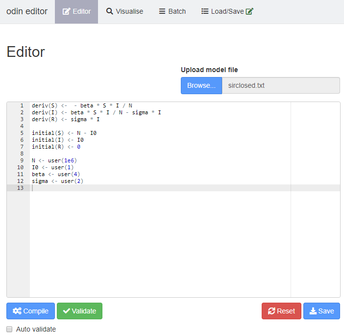
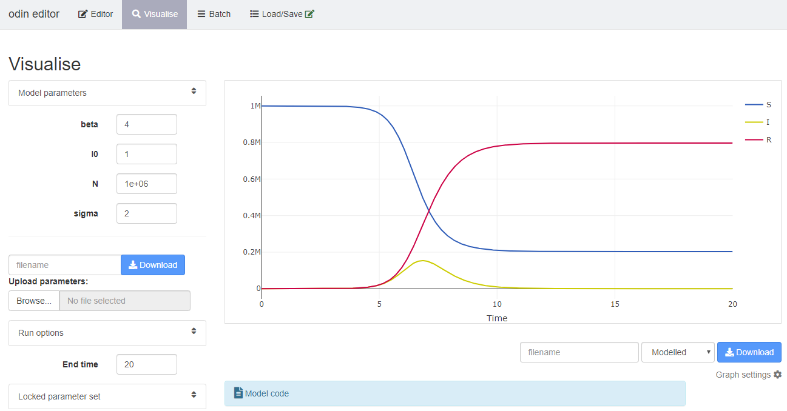

## Introduction

Writing and solving mathematical models using the `odin` interface is an important part of the short course. As a tool, it has been designed to facilitate the learning process of coding and solving models whilst offering neat visualisation of results. Delegates might be interested in transferring their newly developed skills to their own research. We think that the natural progression from the interface environment is to R and Rstudio. However, coding in the short course interface and coding in R, although similar, might not be the same experience. For this, we have prepared a document to make this transition as friendly and intuitive as possible.

Mastering R and programming are long processes. Here, we do not intend to cover all the basics and details of programming in R, but to offer some initial guidance on how to get started. As such, in this document we first provide several useful resources to start using R and Rstudio, (from installation to basic usage), followed by a comparative example between the `odin` interface and R.

## Getting started with R and R studio

[R](https://www.r-project.org) is a programming language widely used in the academic and research community for statistical computing, mathematical modelling and graphic solutions. R is a free software and although it has a baseline set of utilities and functions, one of its strengths is the growing body of packages and extensions developed by its users.

R can be installed from CRAN (see below) and can be used straight after installation. However, for a better experience we recommend the use of [Rstudio](https://rstudio.com). Rstudio is a free integrated development environment (IDE) for R. This means that Rstudio requires an installation of R as a prerequisite for functioning.

### Useful links and learning materials

The following links directly to different learning resources that cover the step by step set up for R and Rstudio as well as the basics of using R, its syntax, managing data and creating R projects.

For the rest of this documentation, it is useful to finalise installation and setup of R and Rstudio on your own computer.


- *RECON learn*: Created by the R Epidemics Consortium it hosts a number of interesting training practicals and lectures. [The introduction to R and R studio resources](https://www.reconlearn.org/post/practical-intror.html) are a very good starting point

- *[Coursera's Data Scientist's Toolbox](https://www.coursera.org/learn/data-scientists-tools)*: Coursera centralise free online courses created by leading universities. The "Data Scientist's Toolbox" covers statistics in R from installation to actual data analysis.


- *[Introduction to R for IDM](https://mrc-ide.github.io/R-for-IDM-Intro/)*: This documentation is part of Imperial College London's online materials, specifcally for infectious disease modelling.


### Odin documentation

The package `odin` was created for R and is the base on which the short course modelling interface operates. This means that it is possible to replicate any work done on the interface, using R, Rstudio and the package `odin` for R.

Full details on the `odin` package can be found in [its documentation](https://mrc-ide.github.io/odin) and in particular its [introductory guide](https://mrc-ide.github.io/odin/articles/odin.html).


## A comparative example of the `odin` interface and `odin` in R

We will use a simple SIR closed model as an example of how results obtained using the short course interface can be reproduced in R and Rstudio.

### SIR closed model using the short course interface


The screen shot below shows the lines of code required to programme, compile and run an SIR model using the short course interface.


```{r echo = FALSE, fig.align = "center", out.width = "85%"}
# All defaults

```


In the visualisation panel you can easily run your compiled SIR model and see the trace of your variables over time. On the left hand-side the current parameters are displayed and can be easily varied for exploration.

```{r echo = FALSE, fig.align = "center", out.width = "100%"}
# All defaults

```


Another feature of the interface is the "Sensitivity" panel. Here, you can explore the sensitivity of model outputs to variations in parameter values. This can be presented in different graphical options. Below is a plot showing the traces of "Number Infected" over time from 100 simulations exploring a +/- 20% variation in the value of *beta*.


```{r echo=FALSE,fig.align="center", out.width="90%"}
# All defaults
knitr::include_graphics("img/batchrun.png")
```

### SIR closed model using R and Rstudio


Here we will replicate the results above using R. As a starting point, Rstudio must be opened and a blank script ready to type our code. Code snippets below should be copied and pasted into your own R script.

As mentioned previously, R provides a complete set of built-in functions and a graphical interface. But most of the tools required to run and explore our epidemic models require the installation of external packages. R packages only need to be installed once on your machine, but need to be loaded every time you need to use their utilities in a new session. For the current example, we require the package `odin`.

You may need to install packages, and you can do this by running:

```{r eval=FALSE}
install.packages("odin")
```

Once packages have been installed, they can be loaded to be made available to your current R session:

```{r echo=TRUE}
library("odin")
```

Now, lets write our model equations using `odin` syntax. Note the initial line is a command to create an `odin` object called "sir". Similarly, the contents of this object are enclosed in brackets.


```{r echo = TRUE, message = FALSE, warning = FALSE}
sir <- odin::odin({
  deriv(S) <-  - beta * S * I / N
  deriv(I) <- beta * S * I / N - sigma * I
  deriv(R) <- sigma * I

  initial(S) <- N - I0
  initial(I) <- I0
  initial(R) <- 0

  N     <- user(1e6)
  I0    <- user(1)
  beta  <- user(4)
  sigma <- user(2)
})
```

Our `sir` object is our model that we can call at any point. Let's create and run an instance of our model and explore its results.


```{r echo = TRUE, message = FALSE, warning = FALSE}
# Create an instance of our odin object called "mod"
mod <- sir()

# Create a time vector (for this example use per week unit times with a total of 20 weeks)
t <- seq(0, 20, by = 0.02)

# Run the model and pass its output to a data frame called "y"
y <- as.data.frame(mod$run(t))

# explore the top rows of our model output
head(y)
```

The output above shows the top 6 rows of our model state variables.

Since we have a set of results, we can plot them to see the model trajectories over time. We will plot using base R graphics to demonstrate.

```{r echo=TRUE, message=FALSE, warning=FALSE}
# Plot model states overtime with base R
cols <- c("#0066CC", "#CCCC00", "#DC143C")
matplot(y[, 1], y[, -1], type = "l", lty = 1, col = cols,
        xlab = "time", ylab = "S, I, R")
```


Now, let's explore the sensitivity of the model to variations in the *beta* parameter by looking at its effect on the number of infected individuals

```{r echo=TRUE, message=FALSE, warning=FALSE}
sims <- 20
# Create a vector of 20 values with -/+ 20% around the initial value of beta
beta <- seq(4 * 0.8, 4 * 1.2, length.out = sims)
```

There are many ways of iterating over this vector of values and collecting the results.  Here, we will define a function `f` that takes a beta value and returns the number of infected individuals over time:

```{r echo = TRUE}
f <- function(beta) {
  mod <- sir(beta = beta)
  mod$run(t)[, "I"]
}
```

(note that for this case, the values `t` and `sir` here are found in the "Global environment" - i.e., the values that you have already saved in your R session. For more information on this programming style see [the functional programming chapter in Advanced R](http://adv-r.had.co.nz/Functional-programming.html))

```{r}
output <- sapply(beta, f)
```

This output can be plotted with base R

```{r}
matplot(output, type = "l", col = cols[2], lty = 1, xlab = "Time", ylab = "I")
```

In this document, we have demomstrated plotting the outputs in base R. However plotting can also be done in any framework of your choice. For example, `ggplot2` is popular for it's flexibility.

We have managed to replicate our results using R.

As you could see, the short course interface was dealing with many details in the background that were hidden from view. Even if the transition to R brings added complexity, it also brings many possibilities.  Hopefully this document was a useful starting point.
